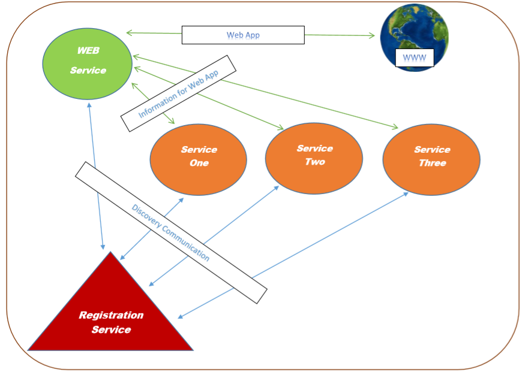

# Basic-Microservices-Example

## An experimental microservices example based on Java & Spring Framework.

### Basic Dependencies:
- Java
- Maven
- Spring Boot
- Spring Cloud
- ...

### Basic Architecture:
